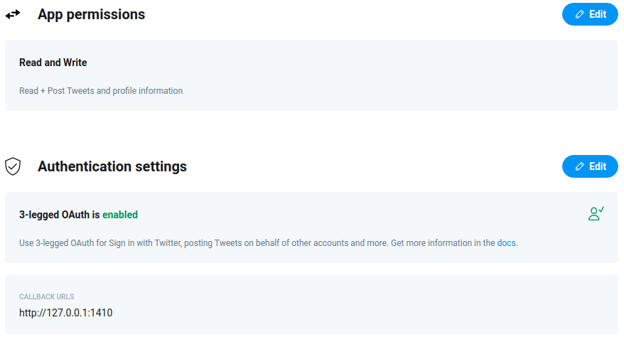

```{r setup, include=FALSE}
knitr::opts_chunk$set(echo = FALSE)
library(rmarkdown)
library(rtweet)

# Setting up bibliography
library(bibtex)
write.bib(.packages(), file = "src/.bib/bib")
write.bib(read.bib("../../src/.bib/pres_debate.bib"), file = "src/.bib/bib", append = TRUE)
```

## Connecting to the Twitter API

> Twitter is built on the robust conversations happening around the world via Tweets. With Twitter’s API platform, you’ll find endpoints to capitalize on the functionality and data contained within Tweets, and to build great experiences and solutions for your customers. These endpoints enable you to manage your Tweets, publish and curate Tweets, filter and search for Tweet topics or trends, and much more [@devtwitter].

### Twitter Developer Portal - Setting up an application

In order to collect tweets I had to apply for an API key from Twitter[^1]. Luckily I was fast enough granted access to the Twitter Developers Portal, enabling me to set up an application which can be connected to R.

  *Figure 1.1 Configuring application on Twitter Developer Portal*

### Creating an Access Token in R

Connecting the newly created application to R, an access token has to be created using the application's API key and secret. I used the create_token() function from rtweet package [@rtweet] to do this, configuring it as follows.

```r
library(rtweet)

key <- 'XXXXXXXXXXXXXXXXX'
secret <- 'XXXXXXXXXXXXXXXXXX'
     
# Connecting to Twitter API
twitter_token <- create_token(
 app = "presidentialdebate",
 consumer_key = key,
 consumer_secret = secret
)
```
## Searching tweets

Having set up a token, tweets can now be searched using the search_tweets() function with the main parameters being q (Query to be searched) and n (total number of desired tweets). As I wanted to perform multiple queries with different keywords, number of tweets and time frames, around both the first and second presidential debate, I decided to create a .csv file with the specifications of each query.

```r
# Grabbing tweets programmatically using a .csv file
ref <- read.csv('twitter_data.csv', stringsAsFactors = FALSE) # .csv file containing paths and search specs
```

```{r}
ref <- read.csv("http://raw.githubusercontent.com/ADernild/pres_debate/main/twitter_data.csv")
paged_table(ref, list(rows.print = 10))
```

The .csv file could then be looped through, passing the specified parameters to search_tweets() at each iteration. For this purpose I wrapped search_tweets() along with saveRDS() to save the queries as .rds files, in a new function I named twitter_grab(). 

```r
twitter_grab <- function(term, n, since, until, type, file) {
  tweets <- search_tweets(q = term,
                          n = n,
                          include_rts = FALSE,
                          lang = "en",
                          since = since,
                          until = until,
                          type = type,
                          retryonratelimit = TRUE
  )
  
  saveRDS(tweets, file = file)
  cat(file, "saved")
}
```


```r
# Looping throug data.frame ref calling twitter_grab() function
for (row in 32:nrow(ref)) {
  twitter_grab(
    ref$term[row],
    ref$n[row],
    ref$since[row],
    ref$until[row],
    ref$type[row],
    ref$path[row]
  )
}
```


[^1]: Twitter grants API keys based on use case and application, documentation, terms and application form can be found [here](https://developer.twitter.com/en)

