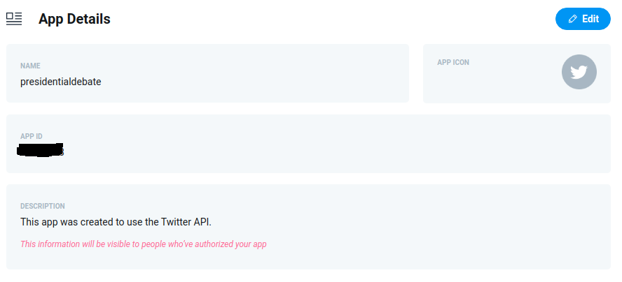
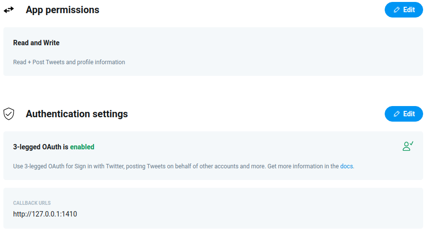

```{r setup, include=FALSE}
knitr::opts_chunk$set(echo = FALSE)
library(rmarkdown)
library(rtweet)

# Setting up bibliography
library(bibtex)
write.bib(.packages(), file = ".bib/bib")
write.bib(read.bib("../../src/.bib/pres_debate.bib"), file = ".bib/bib", append = TRUE)
```

## Twitter's API platform

> Twitter is built on the robust conversations happening around the world via Tweets. With Twitter's API platform, you'll find endpoints to capitalize on the functionality and data contained within Tweets, and to build great experiences and solutions for your customers. These endpoints enable you to manage your Tweets, publish and curate Tweets, filter and search for Tweet topics or trends, and much more [@devtwitter].

The first step, in order to collect tweets, is to acquire an API key for Twitter's Rest API. This is done by applying for one at Twitter's developer portal[^1], luckily for me this process was very brief, and I got my API key within a day.

[^1]: Twitter grants API keys based on use case and application, documentation, terms and application form can be found [here](https://developer.twitter.com/en)

### Twitter Developer Portal - Setting up an application

Having access to Twitter Developers Portal and API, enabled me to set up an application, which could then be used, to connect my R environment with Twitter's API. This would allow me to manipulate the API using R, i.e., searching for Tweet topics or trends at specified time frames.

 *Figure 1.1 Configuring application on Twitter Developer Portal*

Note: It's important, when configuring an application, to set a callback URL to 127.0.0.1:1410. This allows rtweet package to authenticate with your Twitter account. 

### Connecting R to the Twitter API

To connect R to the newly created application, an acccess token has to be created, using the application's API key and secret. I used the create_token() function from rtweet package [@rtweet] to do this, configuring it as follows:

``` {.r}
library(rtweet)

key <- 'XXXXXXXXXXXXXXXXX' #this is not a key
secret <- 'XXXXXXXXXXXXXXXXXX'
     
# Connecting to Twitter API
twitter_token <- create_token(
 app = "presidentialdebate",
 consumer_key = key,
 consumer_secret = secret
)
```

Using create_token() from the rtweet package, saves this token as a variable in .Renviron, allowing one to use Twitter's API without configuring a new token every session.

### Collecting Tweets

Having set up an access token, Twitter's API can now be manipulated through R, using the rtweet package [@rtweet]. To collect Tweets already sent, Tweets can be searched using the search_tweets() function, with the main parameters being q (search query) and n (number of desired tweets). As I wanted to perform multiple queries/searches with different search queries, number of tweets and time frames, around both the first and final presidential debate, I decided to create a .csv file (twitter_data.csv), where each row contains the specifications of a query/search.

**Columns in twitter_data.csv**

-   since (date from which collection should begin)
-   until (date at which collection should cease)
-   n (number of tweets to collect)
-   type (Search type recent/mixed/popular)
-   term (Search term)
-   path (path to save data)
-   altpath (path to save data when cleaned)


```{r}
ref <- read.csv("https://raw.githubusercontent.com/ADernild/pres_debate/main/twitter_data.csv")
paged_table(ref, list(rows.print = 10, cols.print = 4))
```

By doing this, I won't have to hard program all these different search specifications, into separate function calls, but can instead programatically pass each row to a search_tweets() call. This could be done by looping through the rows of twitter_data.csv, passing the specified parameters to search_tweets(), and saving the resulting data.frame as a RData (.rds) file at each iteration. For this purpose I wrapped search_tweets() along with saveRDS() to save the queries as .rds files, in a new function I named twitter_grab():

``` {.r}
twitter_grab <- function(term, n, since, until, type, file) {
  tweets <- search_tweets(q = term,
                          n = n,
                          include_rts = FALSE,
                          lang = "en",
                          since = since,
                          until = until,
                          type = type,
                          retryonratelimit = TRUE
  )
  
  saveRDS(tweets, file = file)
  cat(file, "saved")
}
```

As the Twitter API is limited, to only return tweets sent during the past 7 days, I had to collect the data on multiple occasions. First collecting tweets immediately after the first debate, then 7 days after and doing the same for the final debate. There are probably more elegant ways of doing this e.g., Cron jobs, but I decided to call the loop manually on multiple occasions, specifying, when calling the loop, which rows to query at each occasion.

``` {.r}
# Grabbing tweets programmatically using a .csv file
ref <- read.csv('twitter_data.csv', stringsAsFactors = FALSE) #.csv file containing paths and search specs

# Looping throug data.frame ref calling twitter_grab() function
for (row in 31:nrow(ref)) {
  twitter_grab(
    ref$term[row],
    ref$n[row],
    ref$since[row],
    ref$until[row],
    ref$type[row],
    ref$path[row]
  )
}
```

The above loop being the last I used collect Tweets sent during the week following the final Presidential debate. This loop iterates over the following subset of twitter_data.csv, and pass the search specifications to my function twitter_grab().

```{r}
ref <- read.csv("https://raw.githubusercontent.com/ADernild/pres_debate/main/twitter_data.csv")
paged_table(ref[31:42, ], list(rows.print = 10, cols.print = 4))
```

In total the Twitter data collection resulted in 42 queries (one for each row in twitter_data.csv), which was then saved as 42 individual RData (.rds) files.


